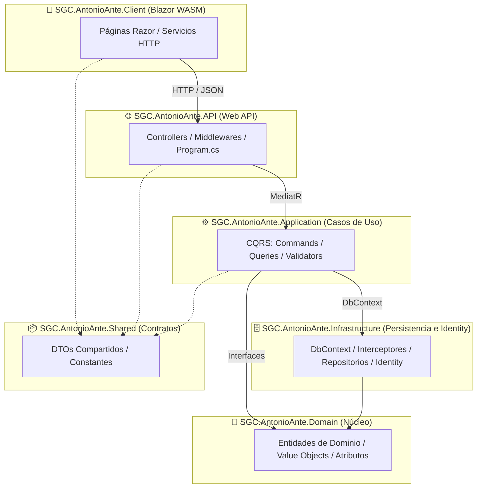
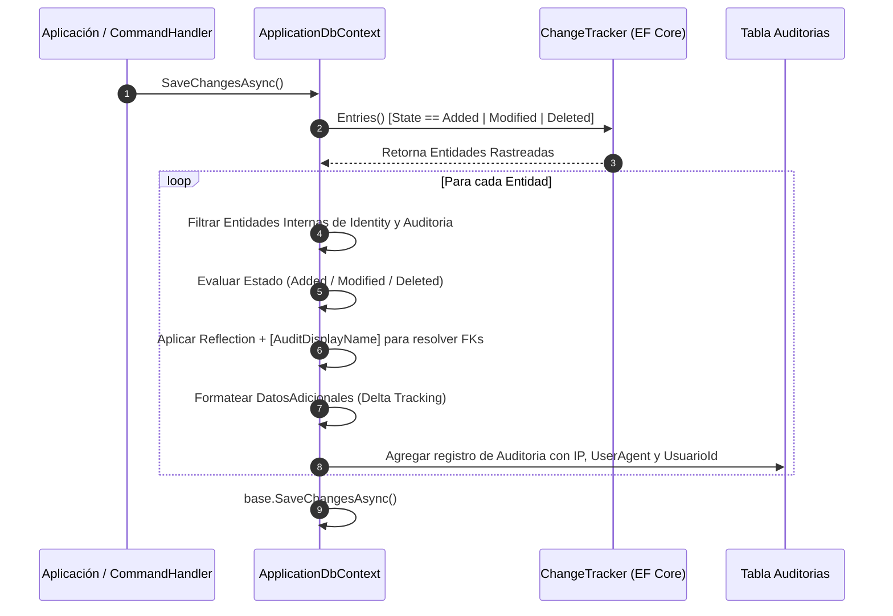
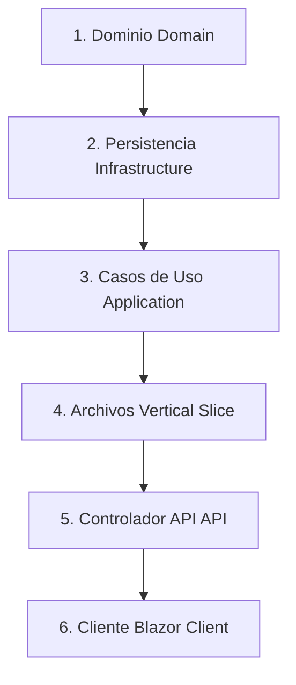

# 📘 Manual de Referencia Técnica y Arquitectura
## Sistema de Gestión Catastral (SGC) - GAD Municipal de Antonio Ante

---

> [!IMPORTANT]
> **Documento Oficial de Referencia Técnica y Arquitectónica**  
> Define los patrones, contratos, clases comunes y flujos de trabajo establecidos en el **Módulo 1 (Seguridad y Auditoría)**. Su aplicación es **obligatoria** para el desarrollo de los módulos posteriores (*Módulo 2: Catastros y Ficha Predial, Módulo de Avalúos, etc.*).

---

## 📑 Tabla de Contenidos
1. [Arquitectura General y Principios de Diseño](#1-arquitectura-general-y-principios-de-diseño)
2. [Componentes Transversales y Clases Comunes](#2-componentes-transversales-y-clases-comunes)
3. [Motor de Auditoría Automática e Interceptor Delta Tracking](#3-motor-de-auditoría-automática-e-interceptor-delta-tracking)
4. [Estándar de Implementación de Casos de Uso (Application Layer)](#4-estándar-de-implementación-de-casos-de-uso-application-layer)
5. [Estándar de Controladores REST (API Layer)](#5-estándar-de-controladores-rest-api-layer)
6. [Patrones de Interfaz y Cliente (Blazor WASM Layer)](#6-patrones-de-interfaz y-cliente-blazor-wasm-layer)
7. [Checklist para la Creación de Nuevos Módulos](#7-checklist-para-la-creación-de-nuevos-módulos-ej-módulo-2---predios)

---

## 🏛️ 1. Arquitectura General y Principios de Diseño

El sistema está estructurado bajo **Clean Architecture** combinada con **CQRS** (*Command Query Responsibility Segregation*) y **Vertical Slice Architecture**.



### 📁 Estructura del Proyecto

```text
SGC.AntonioAnte/
├── SGC.AntonioAnte.Domain/         # Entidades de Dominio, Value Objects, Atributos
├── SGC.AntonioAnte.Application/    # Casos de Uso (CQRS: Commands/Queries planos), Interfaces, Validators
├── SGC.AntonioAnte.Infrastructure/ # DbContext, Interceptores, Persistence, Identity, Identity Services
├── SGC.AntonioAnte.Shared/         # DTOs Compartidos, Constantes, Contratos de Comunicación
├── SGC.AntonioAnte.API/            # Web API Controllers, Middlewares, Program.cs
└── SGC.AntonioAnte.Client/         # Frontend Blazor WASM, Servicios HTTP, Páginas Razor
```

### 🏆 Reglas de Oro de Codificación

| Regla | Descripción | Ejemplo / Alcance |
| :--- | :--- | :--- |
| **Convenio "Spanglish"** | Clases del framework, patrones y sintaxis en **Inglés**; entidades de negocio, campos DB y DTOs en **Español sin tildes**. | `IRequest`, `DbContext`, `ControllerBase` vs. `Usuario`, `Departamento`, `Identificacion`, `EstadoActivo`. |
| **Seguridad OWASP (IDOR)** | Uso exclusivo de `Guid` (UUID v4) como Primary Key ($PK$) en todas las tablas y endpoints REST. | Queda **estrictamente prohibido** exponer IDs secuenciales enteros o datos sensibles (como la Cédula) en las rutas URL. |
| **CQRS Plano (Vertical Slice)** | Cada caso de uso habita en un único archivo plano. | Ubicación obligatoria: `Application/{Modulo}/{Entidad}/Commands/` o `Queries/`. |

---

## 📦 2. Componentes Transversales y Clases Comunes

### 2.1. Contrato de Respuesta de Operaciones (`OperacionResultadoDto`)

> **Ubicación:** `SGC.AntonioAnte.Shared.DTOs.Common.OperacionResultadoDto`  
> Tipo de retorno estándar para todos los **Commands** (*Crear, Actualizar, CambiarEstado, Eliminar*). Evita lanzar excepciones para errores de validación o lógica de negocio.

```csharp
namespace SGC.AntonioAnte.Shared.DTOs.Common
{
    public class OperacionResultadoDto
    {
        public bool Exitoso { get; set; } = true;
        public string Mensaje { get; set; } = string.Empty;
        public object? Datos { get; set; }

        public static OperacionResultadoDto Exito(string mensaje = "Operación realizada con éxito.", object? datos = null)
        {
            return new OperacionResultadoDto { Exitoso = true, Mensaje = mensaje, Datos = datos };
        }

        public static OperacionResultadoDto Fallo(string mensaje = "Ocurrió un error al procesar la solicitud.")
        {
            return new OperacionResultadoDto { Exitoso = false, Mensaje = mensaje };
        }
    }
}
```

---

### 2.2. Estructura de Paginación Global (`ResultadoPaginadoDto<T>`)

> **Ubicación:** `SGC.AntonioAnte.Shared.DTOs.Common.ResultadoPaginadoDto<T>`  
> Clase genérica utilizada por todas las **Queries** que retornan colecciones paginadas desde la base de datos SQL Server.

```csharp
using System;
using System.Collections.Generic;

namespace SGC.AntonioAnte.Shared.DTOs.Common
{
    public class ResultadoPaginadoDto<T>
    {
        public List<T> Items { get; set; } = new();

        // 🔹 Alias de compatibilidad (mapea a Items)
        public List<T> Datos => Items;

        public int TotalRegistros { get; set; }
        public int PaginaActual { get; set; }
        public int RegistrosPorPagina { get; set; }
        public int TotalPaginas { get; set; }

        // 🔹 Helpers para habilitar/deshabilitar controles de navegación en Blazor
        public bool TienePaginaAnterior => PaginaActual > 1;
        public bool TienePaginaSiguiente => PaginaActual < TotalPaginas;

        // 🔹 Creador estático de fábrica que calcula automáticamente TotalPaginas
        public static ResultadoPaginadoDto<T> Crear(List<T> items, int totalRegistros, int paginaActual, int registrosPorPagina)
        {
            var limiteValido = registrosPorPagina > 0 ? registrosPorPagina : 10;
            var paginaValida = paginaActual > 0 ? paginaActual : 1;
            var totalPaginas = (int)Math.Ceiling(totalRegistros / (double)limiteValido);

            return new ResultadoPaginadoDto<T>
            {
                Items = items ?? new List<T>(),
                TotalRegistros = totalRegistros,
                PaginaActual = paginaValida,
                RegistrosPorPagina = limiteValido,
                TotalPaginas = totalPaginas
            };
        }
    }
}
```

---

### 2.3. Atributo para Traducción Automática de Auditoría (`[AuditDisplayName]`)

> **Ubicación:** `SGC.AntonioAnte.Domain.Common.Attributes.AuditDisplayNameAttribute`  
> Permite decorar propiedades de Clave Foránea (`Guid`) en las entidades de dominio para indicar al interceptor de auditoría cuál es la propiedad de navegación y qué campo de texto legible debe extraerse para la bitácora.

```csharp
using System;

namespace SGC.AntonioAnte.Domain.Common.Attributes
{
    [AttributeUsage(AttributeTargets.Property, AllowMultiple = false)]
    public class AuditDisplayNameAttribute : Attribute
    {
        public string NavigationPropertyName { get; }
        public string DisplayPropertyName { get; }

        public AuditDisplayNameAttribute(string navigationPropertyName, string displayPropertyName = "Nombre")
        {
            NavigationPropertyName = navigationPropertyName;
            DisplayPropertyName = displayPropertyName;
        }
    }
}
```

#### 💡 Ejemplo de uso en una Entidad del Dominio:
```csharp
public class Usuario : IdentityUser<Guid>
{
    // 🔹 Decoramos indicando que DepartamentoId debe traducirse usando la propiedad Departamento.Nombre
    [AuditDisplayName(nameof(Departamento), nameof(Entities.Departamento.Nombre))]
    public Guid? DepartamentoId { get; set; }
    
    public virtual Departamento? Departamento { get; set; }
}
```

---

## 🕵️‍♂️ 3. Motor de Auditoría Automática e Interceptor Delta Tracking

Toda la auditoría automática se procesa a nivel de infraestructura en `ApplicationDbContext.cs` antes de confirmar cambios en SQL Server.



### 3.1. Arquitectura del Interceptor (`ApplicationDbContext.cs`)

```csharp
// Fragmento clave de ApplicationDbContext.cs
public override async Task<int> SaveChangesAsync(CancellationToken cancellationToken = default)
{
    var entradasRastreadas = ChangeTracker.Entries()
        .Where(e => (e.State == EntityState.Added || e.State == EntityState.Modified || e.State == EntityState.Deleted)
                    && e.Entity is not Auditoria
                    && !EsTablaInternaIdentity(e.Entity))
        .ToList();

    var nuevasAuditorias = new List<Auditoria>();

    foreach (var entry in entradasRastreadas)
    {
        string nombreEntidad = entry.Entity.GetType().Name;
        var idPropiedad = entry.Properties.FirstOrDefault(p => p.Metadata.Name == "Id")?.CurrentValue?.ToString() ?? "N/A";

        string accion = string.Empty;
        string datosAdicionales = string.Empty;

        switch (entry.State)
        {
            case EntityState.Added:
                accion = $"CREAR_{nombreEntidad.ToUpper()}";
                var camposCreados = entry.Properties
                    .Where(p => !EsPropiedadOmitida(p.Metadata.Name) && p.CurrentValue != null)
                    .Select(p => FormatearCampoCreado(p, entry.Entity));
                datosAdicionales = $"Registro creado: {string.Join(" | ", camposCreados)}";
                break;

            case EntityState.Modified:
                accion = $"ACTUALIZAR_{nombreEntidad.ToUpper()}";
                var cambios = new List<string>();
                bool esCambioEstadoExclusivo = false;
                bool nuevoEstadoActivo = false;

                foreach (var propiedad in entry.Properties)
                {
                    if (propiedad.IsModified && !EsPropiedadOmitida(propiedad.Metadata.Name))
                    {
                        var valorAnterior = propiedad.OriginalValue ?? "null";
                        var valorNuevo = propiedad.CurrentValue ?? "null";

                        if (valorAnterior.ToString() != valorNuevo.ToString())
                        {
                            cambios.Add(FormatearCampoModificado(propiedad, entry.Entity));

                            if (propiedad.Metadata.Name.Equals("EstadoActivo", StringComparison.OrdinalIgnoreCase))
                            {
                                esCambioEstadoExclusivo = true;
                                nuevoEstadoActivo = Convert.ToBoolean(propiedad.CurrentValue);
                            }
                        }
                    }
                }

                if (!cambios.Any()) continue;

                // 🎯 Si solo cambió el EstadoActivo, clasifica automáticamente como ACTIVAR o DESACTIVAR
                if (cambios.Count == 1 && esCambioEstadoExclusivo)
                {
                    accion = nuevoEstadoActivo ? $"ACTIVAR_{nombreEntidad.ToUpper()}" : $"DESACTIVAR_{nombreEntidad.ToUpper()}";
                }

                datosAdicionales = $"Cambios aplicados: {string.Join(" | ", cambios)}";
                break;

            case EntityState.Deleted:
                accion = $"ELIMINAR_{nombreEntidad.ToUpper()}";
                var valoresEliminados = entry.Properties
                    .Where(p => !EsPropiedadOmitida(p.Metadata.Name) && p.OriginalValue != null)
                    .Select(p => FormatearCampoEliminado(p, entry.Entity));
                datosAdicionales = $"Registro eliminado: {string.Join(" | ", valoresEliminados)}";
                break;
        }

        nuevasAuditorias.Add(new Auditoria
        {
            UsuarioId = _currentUserService.UsuarioIdGuid,
            Accion = accion,
            Entidad = nombreEntidad,
            EntidadId = idPropiedad,
            DatosAdicionales = datosAdicionales,
            DireccionIp = _currentUserService.IpAddress,
            Navegador = _currentUserService.UserAgent,
            FechaCreacion = DateTime.UtcNow
        });
    }

    if (nuevasAuditorias.Any())
    {
        Auditorias.AddRange(nuevasAuditorias);
    }

    return await base.SaveChangesAsync(cancellationToken);
}
```

### 3.2. Formato de Salida en la Bitácora (`DatosAdicionales`)

| Operación | Ejemplo de Registro Generado en `DatosAdicionales` |
| :--- | :--- |
| **Creación** | `Registro creado: Identificacion: '1306417120' \| Nombres: 'Luis' \| Apellidos: 'Palama' \| Departamento: 'Recursos Humanos'` |
| **Actualización** | `Cambios aplicados: Apellidos: 'Perugachi' -> 'Perugachi Ibisa' \| Departamento: 'Avalúos' -> 'Recursos Humanos'` |
| **Cambio Estado** | `Cambios aplicados: EstadoActivo: 'True' -> 'False'` *(Clasificado con Acción: `DESACTIVAR_USUARIO`)* |
| **Asignación Roles** | `Modificación en rol 'TecnicoCatastral': Agregados (+2): [Permissions.Predios.Editar] \| Removidos (-1): [Permissions.Usuarios.Ver]` |

---

## 🛠️ 4. Estándar de Implementación de Casos de Uso (Application Layer)

Estructura de directorios organizada bajo **Vertical Slice**:

```text
SGC.AntonioAnte.Application/
└── Seguridad/
    ├── Departamentos/
    │   ├── Commands/
    │   │   ├── CreateDepartamentoCommand.cs
    │   │   ├── UpdateDepartamentoCommand.cs
    │   │   ├── CambiarEstadoDepartamentoCommand.cs
    │   │   └── DeleteDepartamentoCommand.cs
    │   └── Queries/
    │       └── GetDepartamentosQuery.cs
    ├── Roles/
    │   ├── Commands/
    │   │   ├── CreateRolCommand.cs
    │   │   ├── UpdateRolCommand.cs
    │   │   ├── DeleteRolCommand.cs
    │   │   ├── AsignarRolUsuarioCommand.cs
    │   │   ├── DesasignarRolUsuarioCommand.cs
    │   │   ├── AsignarPermisosRolCommand.cs
    │   │   └── AsignarPermisosGranularesCommand.cs
    │   └── Queries/
    │       ├── GetRolesQuery.cs
    │       ├── GetPermisosRolQuery.cs
    │       └── GetPermisosUsuarioQuery.cs
    └── Usuarios/
        ├── Commands/
        │   ├── CreateUsuarioCommand.cs
        │   ├── UpdateUsuarioCommand.cs
        │   ├── CambiarEstadoUsuarioCommand.cs
        │   └── AsignarPermisoUsuarioCommand.cs
        └── Queries/
            └── GetUsuariosQuery.cs
```

---

### 4.1. Estructura Plantilla de un Comando (`Command.cs`)

Cada archivo de comando contiene **3 partes**:
1. `record` posicional e inmutable (*Command*)
2. `AbstractValidator` (*FluentValidation*)
3. `IRequestHandler` (*Handler*)

```csharp
using FluentValidation;
using MediatR;
using SGC.AntonioAnte.Application.Common.Interfaces;
using SGC.AntonioAnte.Shared.DTOs.Common;
using System;
using System.Threading;
using System.Threading.Tasks;

namespace SGC.AntonioAnte.Application.Seguridad.Ejemplo.Commands
{
    // 1. COMMAND (record posicional e inmutable)
    public record MiComandoCommand(Guid Id, string Nombre, bool Estado) : IRequest<OperacionResultadoDto>;

    // 2. VALIDATOR (FluentValidation)
    public class MiComandoCommandValidator : AbstractValidator<MiComandoCommand>
    {
        public MiComandoCommandValidator()
        {
            RuleFor(v => v.Id)
                .NotEmpty().WithMessage("El identificador es obligatorio.");

            RuleFor(v => v.Nombre)
                .NotEmpty().WithMessage("El nombre es obligatorio.")
                .MaximumLength(150).WithMessage("El nombre no debe superar los 150 caracteres.");
        }
    }

    // 3. HANDLER
    public class MiComandoCommandHandler : IRequestHandler<MiComandoCommand, OperacionResultadoDto>
    {
        private readonly IApplicationDbContext _context;

        public MiComandoCommandHandler(IApplicationDbContext context)
        {
            _context = context;
        }

        public async Task<OperacionResultadoDto> Handle(MiComandoCommand request, CancellationToken cancellationToken)
        {
            // Lógica de negocio
            // ...

            await _context.SaveChangesAsync(cancellationToken);
            return OperacionResultadoDto.Exito("Operación procesada correctamente.");
        }
    }
}
```

---

### 4.2. Estructura Plantilla de una Consulta Paginada (`Query.cs`)

```csharp
using MediatR;
using Microsoft.EntityFrameworkCore;
using SGC.AntonioAnte.Application.Common.Interfaces;
using SGC.AntonioAnte.Shared.DTOs.Common;
using System.Linq;
using System.Threading;
using System.Threading.Tasks;

namespace SGC.AntonioAnte.Application.Seguridad.Ejemplo.Queries
{
    // 1. QUERY (record posicional con valores por defecto)
    public record GetEjemploQuery(
        string? Busqueda = null,
        bool? EstadoActivo = null,
        int Pagina = 1,
        int RegistrosPorPagina = 10
    ) : IRequest<ResultadoPaginadoDto<MiDtoResponse>>;

    // 2. HANDLER
    public class GetEjemploQueryHandler : IRequestHandler<GetEjemploQuery, ResultadoPaginadoDto<MiDtoResponse>>
    {
        private readonly IApplicationDbContext _context;

        public GetEjemploQueryHandler(IApplicationDbContext context)
        {
            _context = context;
        }

        public async Task<ResultadoPaginadoDto<MiDtoResponse>> Handle(GetEjemploQuery request, CancellationToken cancellationToken)
        {
            var query = _context.MiTabla.AsNoTracking().AsQueryable();

            if (!string.IsNullOrWhiteSpace(request.Busqueda))
            {
                var busquedaNorm = request.Busqueda.Trim().ToLower();
                query = query.Where(x => x.Nombre.ToLower().Contains(busquedaNorm));
            }

            int totalRegistros = await query.CountAsync(cancellationToken);
            int pagina = request.Pagina < 1 ? 1 : request.Pagina;
            int registrosPorPagina = request.RegistrosPorPagina < 1 ? 10 : request.RegistrosPorPagina;

            var items = await query
                .OrderBy(x => x.Nombre)
                .Skip((pagina - 1) * registrosPorPagina)
                .Take(registrosPorPagina)
                .Select(x => new MiDtoResponse { /* Mapeo */ })
                .ToListAsync(cancellationToken);

            return ResultadoPaginadoDto<MiDtoResponse>.Crear(items, totalRegistros, pagina, registrosPorPagina);
        }
    }
}
```

---

## 🌐 5. Estándar de Controladores REST (API Layer)

Los controladores actúan como una capa delegada delgada hacia `IMediator`.

```csharp
namespace SGC.AntonioAnte.API.Controllers.Seguridad
{
    [ApiController]
    [Route("api/v1/seguridad/usuarios")]
    [Authorize(Roles = "AdminSistemas,SuperAdmin")]
    public class UsuariosController : ControllerBase
    {
        private readonly IMediator _mediator;

        public UsuariosController(IMediator mediator)
        {
            _mediator = mediator;
        }

        [HttpGet]
        public async Task<IActionResult> ObtenerPaginado(
            [FromQuery] string? busqueda,
            [FromQuery] bool? estadoActivo,
            [FromQuery] Guid? departamentoId,
            [FromQuery] int pagina = 1,
            [FromQuery] int registrosPorPagina = 10)
        {
            var query = new GetUsuariosQuery(busqueda, estadoActivo, departamentoId, pagina, registrosPorPagina);
            var resultado = await _mediator.Send(query);
            return Ok(resultado);
        }

        [HttpPost]
        public async Task<IActionResult> Registrar([FromBody] CreateUsuarioDto dto)
        {
            var command = new CreateUsuarioCommand(
                dto.Identificacion, dto.Nombres, dto.Apellidos,
                dto.Email, dto.DepartamentoId, dto.Password, dto.RolAsignado
            );

            var resultado = await _mediator.Send(command);

            if (!resultado.Exitoso)
                return BadRequest(new { mensaje = resultado.Mensaje });

            return Ok(resultado);
        }

        [HttpPut("{id:guid}/cambiar-estado")]
        public async Task<IActionResult> CambiarEstado([FromRoute] Guid id)
        {
            var command = new CambiarEstadoUsuarioCommand(id);
            var resultado = await _mediator.Send(command);

            if (!resultado.Exitoso)
                return BadRequest(new { mensaje = resultado.Mensaje });

            return Ok(resultado);
        }
    }
}
```

---

## 🎨 6. Patrones de Interfaz y Cliente (Blazor WASM Layer)

En las páginas Blazor (`.razor`) se siguen los siguientes estándares visuales y de comportamiento:

* **Búsqueda en Tiempo Real con Debounce (350ms):** Evita peticiones HTTP excesivas al servidor mientras el usuario escribe en la caja de texto.
* **Botón "Limpiar Filtros":** Resetea los controles de búsqueda, dropdowns de estado/departamento y devuelve la consulta a la página 1.
* **Pie de Tabla Paginado (Visibilidad Condicional):** Evaluado mediante `@if (resultadoPaginado != null && resultadoPaginado.TotalRegistros > 0)`.
* **Navegación Deshabilitada:** Botones *Anterior* y *Siguiente* vinculados a las propiedades `resultadoPaginado.TienePaginaAnterior` y `resultadoPaginado.TienePaginaSiguiente`.

```csharp
private void OnBusquedaKeyUp(KeyboardEventArgs e)
{
    _debounceTimer?.Dispose();
    _debounceTimer = new System.Threading.Timer(_ =>
    {
        InvokeAsync(async () =>
        {
            paginaActual = 1;
            await CargarDatosPaginados();
            StateHasChanged();
        });
    }, null, 350, Timeout.Infinite);
}
```

---

## 📋 7. Checklist para la Creación de Nuevos Módulos (Ej: Módulo 2 - Predios)

Cuando se inicie la construcción de nuevos módulos (*Módulo 2: Gestión Predial y Ficha Catastral*), la secuencia exacta de pasos a ejecutar será:



- [ ] **1. Dominio (`Domain`):** Crear entidad (ej. `Predio.cs`), definir $PK$ `Guid Id` y decorar sus claves foráneas con `[AuditDisplayName(nameof(Propietario), nameof(Propietario.RazonSocial))]`.
- [ ] **2. Persistencia (`Infrastructure`):** Crear la configuración Fluent API en `Configurations/Catastro/PredioConfiguration.cs` asignando esquema `Catastro.Predios`.
- [ ] **3. Casos de Uso (`Application`):** Crear la carpeta `Application/Catastro/Predios/` con sus subcarpetas `Commands/` y `Queries/`.
- [ ] **4. Archivos Vertical Slice:** Implementar `CreatePredioCommand.cs`, `UpdatePredioCommand.cs`, `GetPrediosQuery.cs` usando `record` posicionales, `FluentValidation` y retornos con `OperacionResultadoDto` o `ResultadoPaginadoDto<PredioResponseDto>`.
- [ ] **5. Controlador API (`API`):** Crear `PrediosController.cs` bajo la ruta `/api/v1/catastro/predios`.
- [ ] **6. Cliente Blazor (`Client`):** Crear servicio `IPredioService`, `PredioService` y la vista Razor `Predios.razor` reutilizando la barra de filtros con Debounce y el footer paginado.