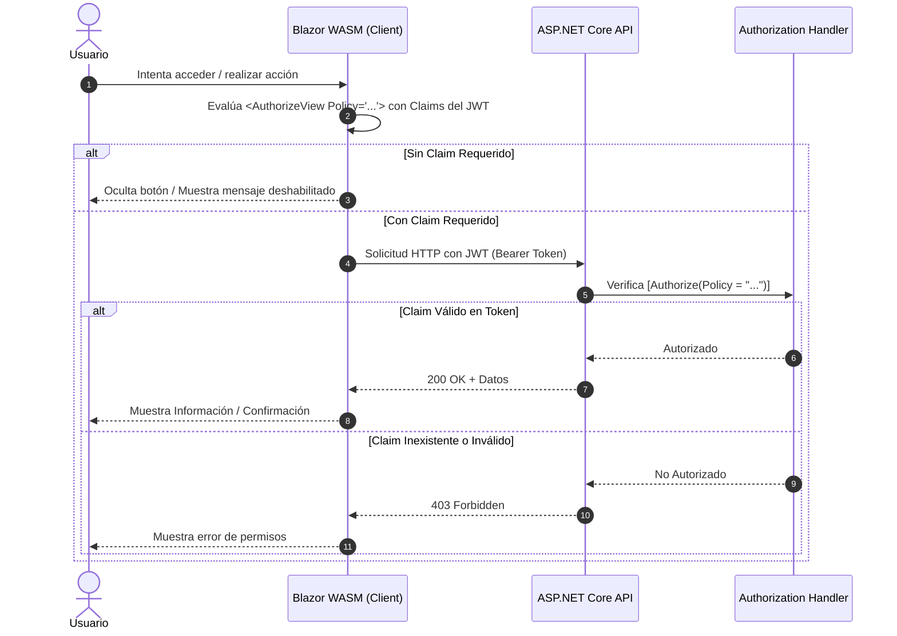
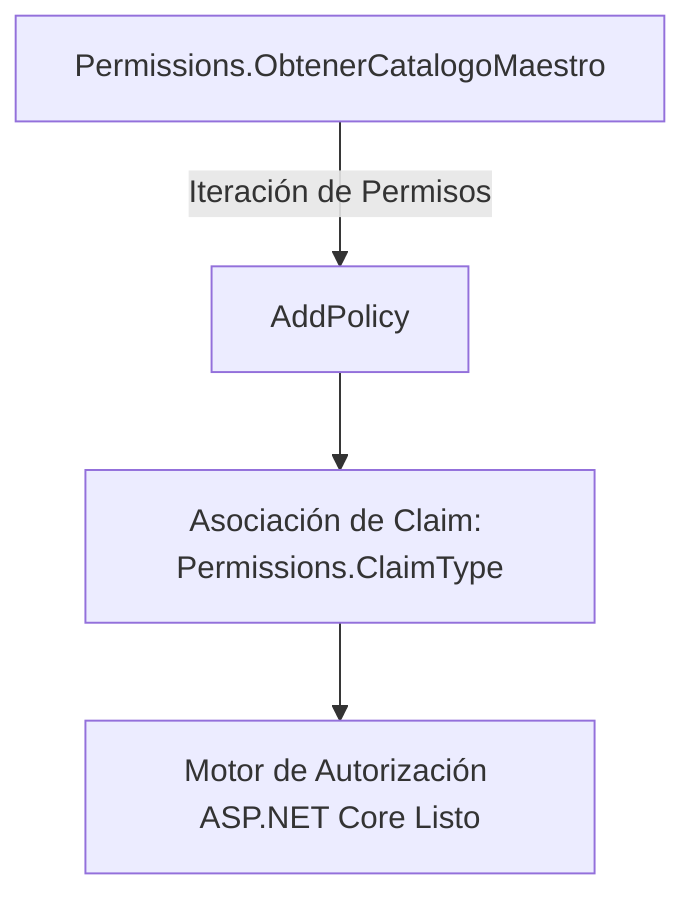

# 🛡️ Guía de Despliegue de Políticas de Autorización y Claims

**Proyecto:** SGC Antonio Ante  
**Estado:** Pendiente de ejecución (Fase Final de Seguridad)  
**Objetivo:** Activar el control de acceso fino basado en atributos `[Authorize(Policy = ...)]` en Controllers y componentes Blazor WASM.

---

## 📋 Antecedentes

Actualmente, las vallas de seguridad de los controladores están restringidas a roles globales:
`[Authorize(Roles = "AdminSistemas,SuperAdmin")]`.

La matriz de permisos ya se encuentra completamente estandarizada en la capa Shared (`Permissions.cs`) bajo la convención:
`[Módulo].[Acción]` -> *(Lectura, Creación, Edición, Eliminación)*.

---

## 🔄 Flujo de Arquitectura y Autorización



---

## 🛠️ Pasos para la Implementación Futura

### 1. Registrar las Políticas de Autorización en el Backend (`Program.cs`)

En el proyecto `SGC.AntonioAnte.API/Program.cs`, registrar dinámicamente las políticas a partir del catálogo maestro:

```csharp
builder.Services.AddAuthorization(options =>
{
    foreach (var permiso in Permissions.ObtenerCatalogoMaestro())
    {
        options.AddPolicy(permiso.ValorClaim, policy =>
            policy.RequireClaim(Permissions.ClaimType, permiso.ValorClaim));
    }
});
```



### 2. Proteger los Controladores del API (Controllers)

Sustituir o complementar las directivas de rol por políticas de claims específicos:

```csharp
[ApiController]
[Route("api/v1/catastro/fichas")]
public class FichasCatastralesController : ControllerBase
{
    [HttpGet]
    [Authorize(Policy = Permissions.Catastro.Lectura)]
    public async Task<IActionResult> ConsultarFichas() { ... }

    [HttpPost]
    [Authorize(Policy = Permissions.Catastro.Creacion)]
    public async Task<IActionResult> CrearFicha(...) { ... }

    [HttpPut("{id}")]
    [Authorize(Policy = Permissions.Catastro.Edicion)]
    public async Task<IActionResult> ActualizarFicha(...) { ... }

    [HttpDelete("{id}")]
    [Authorize(Policy = Permissions.Catastro.Eliminacion)]
    public async Task<IActionResult> AnularFicha(...) { ... }
}
```

### 3. Proteger la Interfaz de Usuario en Blazor WASM (Client)

Usar el componente `<AuthorizeView>` de Blazor para ocultar o deshabilitar elementos visuales (botones, tablas, menús) según los claims del usuario autenticado:

```razor
<AuthorizeView Policy="@Permissions.Catastro.Creacion">
    <Authorized>
        <button class="btn btn-primary" @onclick="AbrirModalCrear">Nueva Ficha</button>
    </Authorized>
</AuthorizeView>
```

---

*Fin del documento de respaldo.*