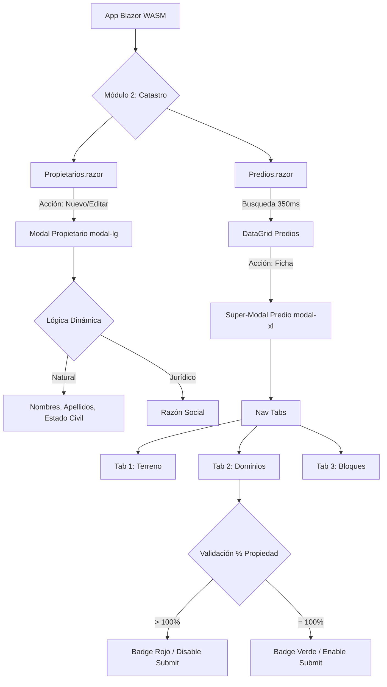

# 🗺️ Plan Maestro de Desarrollo Frontend (UI/UX): Módulo 2 - Ficha Catastral
## Sistema de Gestión Catastral (SGC) - GAD Municipal de Antonio Ante

---

> [!IMPORTANT]
> **Documento Oficial de Arquitectura UI/UX y Hoja de Ruta**  
> Define los lineamientos visuales, la estructura de componentes Blazor y la secuencia de integración con la API REST para el Módulo 2 (Sujetos de Derecho y Fichas Catastrales).

---

## 📑 Tabla de Contenidos
1. [Estándares UI/UX Acordados (Reglas de Oro)](#1-estándares-uiux-acordados-reglas-de-oro)
2. [Hoja de Ruta de Ejecución (Sprints)](#2-hoja-de-ruta-de-ejecución-sprints)
3. [Flujo de Navegación y Componentes (Diagrama)](#3-flujo-de-navegación-y-componentes-diagrama)
4. [Mockup Arquitectónico (Predios.razor)](#4-mockup-arquitectónico-componente-prediosrazor)

---

## 🏛️ 1. Estándares UI/UX Acordados (Reglas de Oro)

Para mantener la coherencia con el Módulo de Seguridad y garantizar una experiencia de usuario (UX) fluida y corporativa, se aplicarán las siguientes reglas [cite: 7]:

| Regla / Estándar | Descripción y Aplicación |
| :--- | :--- |
| **Arquitectura SPA (Single Page Application)** | No navegaremos a sub-páginas para crear o editar registros. Toda interacción de una entidad se realizará en su página principal (ej. `Predios.razor`) usando **DataGrids** para listar y **Modales** (`modal-lg` o `modal-xl`) para formularios. |
| **Estados de Carga (Loading)** | - **Inicial:** Splash-screen nativo en `index.html`.<br>- **Procesos:** Spinners locales de Bootstrap en tablas/modales (`@if(cargando)`). |
| **Gestión de Errores y Alertas** | - **Toasts:** Exclusivos para alertas globales de éxito o fallos de red/servidor.<br>- **Inline Validation:** Exclusivo para errores de formulario mediante `<DataAnnotationsValidator />` y `<ValidationMessage>`. |
| **Cero Datos Quemados** | Todo elemento `<select>` de catálogos (Tenencia, Estructura, Conservación) se poblará consumiendo la API asíncronamente al inicializar el componente o modal. |
| **Debounce en Búsquedas** | Los inputs de búsqueda general aplicarán un retraso de **350ms** antes de disparar la consulta HTTP para optimizar recursos del servidor. |

---

## 🚀 2. Hoja de Ruta de Ejecución (Sprints)

El desarrollo del frontend se dividirá en **4 Pasos** para ir integrando gradualmente la complejidad del Módulo 2 y realizando commits limpios a la rama `feature-catastro` [cite: 7].

### 📦 Paso 1: Cimientos y Conectividad (Setup Shared & Services)
* **Objetivo:** Preparar el terreno para que Blazor entienda los modelos de datos del Catastro y sepa cómo comunicarse con la API.
* **Tareas:**
  1. Integrar los Enums (`TipoPredio`, `TipoPropietario`, `EstadoCivil`) en `SGC.AntonioAnte.Shared`.
  2. Integrar DTOs de Catálogos, Propietarios y Predios en `SGC.AntonioAnte.Shared` con `DataAnnotations` en español.
  3. Crear contratos (`ICatalogoService`, `IPropietarioService`, `IPredioService`) e implementaciones inyectando el `HttpClient` protegido (IdentityHandler).
* **Hito Git:** `feat(catastro-front): setup de dtos, enums y servicios http`

### 👥 Paso 2: Gestión de Sujetos de Derecho (`Propietarios.razor`)
* **Objetivo:** Construir la interfaz para administrar ciudadanos y empresas (HU-CAT-03).
* **UI/UX:**
  * **Grid Principal:** `container-fluid`, paginación server-side, buscador debounce por Cédula/RUC y nombres.
  * **Modal Formulario (`modal-lg`):** Formulario reactivo.
  * *Lógica Dinámica:* Si es `Natural` muestra Nombres/Apellidos/EstadoCivil; si es `Juridico` oculta lo anterior y muestra RazonSocial.
* **Hito Git:** `feat(catastro-front): ui administracion de sujetos de derecho`

### 🏢 Paso 3: Dashboard y Modal Ficha Catastral (`Predios.razor`) - Parte 1
* **Objetivo:** Construir el grid principal de predios y estructurar el Super-Modal de la Ficha.
* **UI/UX:**
  * **Grid Principal:** Buscador por Clave Catastral. Badges distintivos (Urbanos/Rurales).
  * **Super-Modal (`modal-xl`):** Uso de `<ul class="nav nav-tabs">` para dividir carga cognitiva.
  * **Pestaña 1 (Terreno):** Input Clave Catastral (19-28 dígitos), Áreas, Tipo, Dirección. Carga paralela de catálogos en 2do plano.
* **Hito Git:** `feat(catastro-front): dashboard de predios y tab inicial de terreno`

### 🔗 Paso 4: Ficha Catastral (Dominios y Edificaciones) - Parte 2
* **Objetivo:** Finalizar la lógica compleja dentro del Modal de la Ficha Catastral.
* **UI/UX:**
  * **Pestaña 2 (Dominios):** Tabla interna para listar propietarios del lote. Modal anidado o buscador inline por cédula. **Validación algorítmica visual:** Badge con suma de porcentaje (si supera 100%, se pone rojo y deshabilita guardar).
  * **Pestaña 3 (Bloques):** Tabla interna para bloques (pisos, área). Uso de catálogos cargados de la API (`<select>`).
* **Hito Git:** `feat(catastro-front): logica de dominios, bloques y validacion 100% ficha`

---

## 🗺️ 3. Flujo de Navegación y Componentes (Diagrama)



---

## 🧩 4. Mockup Arquitectónico del Componente `Predios.razor`

Esqueleto del componente principal respetando el patrón SPA y Reactividad:

```html
<div class="container-fluid">
    <!-- 1. HEADER Y BARRA DE FILTROS (Con Debounce) -->
    <Header/>
    <FiltrosBusqueda/>

    <!-- 2. DATAGRID DE PREDIOS -->
    <TablaPredios/>
    <PaginacionServerSide/>

    <!-- 3. SUPER-MODAL: FICHA CATASTRAL (modal-xl) -->
    @if (mostrarModalFicha)
    {
        <div class="modal modal-xl">
            <!-- TABS DE NAVEGACIÓN -->
            <ul class="nav nav-tabs">
                <li>Terreno</li>
                <li>Propietarios (Dominios)</li>
                <li>Edificaciones (Bloques)</li>
            </ul>

            <EditForm>
                <DataAnnotationsValidator/>
                
                <!-- TAB CONTENT -->
                <div class="tab-content">
                    <TabTerreno/>
                    <TabDominios/>
                    <TabEdificaciones/>
                </div>

                <!-- VALIDATION MESSAGES (Inline) & SUBMIT -->
                <ValidationSummary/>
                <button type="submit" disabled="@(SuperaCienPorciento)">Guardar Ficha</button>
            </EditForm>
        </div>
    }
    
    <!-- 4. TOASTS GLOBALES -->
    <ToastNotificaciones/>
</div>
```