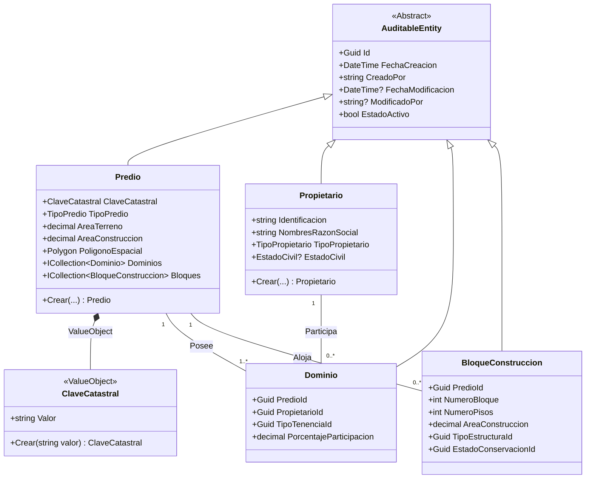

# 🗺️ Plan Maestro de Desarrollo: Módulo 2 - Ficha Catastral
## Sistema de Gestión Catastral (SGC) - GAD Municipal de Antonio Ante

---

> [!IMPORTANT]
> **Documento Oficial de Planificación y Arquitectura Técnica** 
> Este documento establece la hoja de ruta, diseño de dominio, patrones de persistencia y flujo de implementación bajo **Vertical Slice Architecture** para el **Módulo 2: Ficha Catastral** del Sistema de Gestión Catastral (SGC) del GAD Municipal de Antonio Ante.

---

## 📑 Tabla de Contenidos
1. [Estrategia y Metodología de Desarrollo](#1-estrategia-y-metodología-de-desarrollo)
2. [Hoja de Ruta Visual (Workflow)](#2-hoja-de-ruta-visual-workflow)
3. [Desglose Detallado de Pasos](#3-desglose-detallado-de-pasos)
   - [Paso 1: Diseño de Dominio (Domain Layer) 📍 (Fase Actual)](#paso-1-diseño-de-dominio-domain-layer--fase-actual)
   - [Paso 2: Persistencia e Infraestructura GIS (Infrastructure Layer)](#paso-2-persistencia-e-infraestructura-gis-infrastructure-layer)
   - [Paso 3: Catálogos Dinámicos (Application & API Layers) - HU-CAT-01](#paso-3-catálogos-dinámicos-application--api-layers---hu-cat-01)
   - [Paso 4: Sujetos de Derecho / Propietarios (Application & API Layers) - HU-CAT-03](#paso-4-sujetos-de-derecho--propietarios-application--api-layers---hu-cat-03)
   - [Paso 5: Transaccionalidad Core - El Predio (Application & API Layers)](#paso-5-transaccionalidad-core---el-predio-application--api-layers)
4. [Diagrama del Modelo de Dominio (DDD)](#4-diagrama-del-modelo-de-dominio-ddd)

---

## 🏛️ 1. Estrategia y Metodología de Desarrollo

La construcción del Módulo 2 se ejecutará bajo la metodología **Vertical Slicing**, agrupando la funcionalidad por impacto directo en el esquema de base de datos (`SQL Server` / `PostGIS`) y en los flujos de interfaz de usuario (`Blazor WASM`).

### 💡 Principios Rectores:
* **Convenio "Spanglish":** 
  * **Inglés:** Clases del framework, patrones y sintaxis (`IRequest`, `IRequestHandler`, `IEntityTypeConfiguration`, `ValueObject`).
  * **Español (sin tildes):** Entidades de negocio, Value Objects, tablas DDL y DTOs (`Predio`, `Propietario`, `ClaveCatastral`, `TipoTenencia`).
* **Seguridad OWASP (Anti-IDOR):** 
  * Claves primarias ($PK$) basadas exclusivamente en `Guid` (UUID v4).
  * La `ClaveCatastral` se trata como un *Value Object* inmutable con índice único.
* **Trazabilidad de Auditoría:** 
  * Herencia obligatoria de la clase abstracta `AuditableEntity`.
  * Decoración de claves foráneas con `[AuditDisplayName]` para traducir UUIDs a texto descriptivo en los registros de auditoría.

---

## 🗺️ 2. Hoja de Ruta Visual (Workflow)

```mermaid
flowchart TD
    subgraph P1 ["📍 Paso 1: Domain Layer (Fase Actual)"]
        A1[Enums: TipoPredio, TipoPropietario, EstadoCivil]
        A2[Value Object: ClaveCatastral DPA MIDUVI]
        A3[Entidades Catálogo: TipoTenencia, TipoEstructura, EstadoConservacion]
        A4[Entidades Core DDD: Predio, Propietario, Dominio, BloqueConstruccion]
    end

    subgraph P2 ["🗄️ Paso 2: Infrastructure Layer"]
        B1[Fluent API Configurations Catastro]
        B2[Mapeo Geometry NTS & Value Objects]
        B3[Migración EF Core: InitialCatastroModule]
    end

    subgraph P3 ["⚙️ Paso 3: Catálogos Dinámicos (HU-CAT-01)"]
        C1[Commands, Queries & Validators Catálogos]
        C2[Endpoints REST /api/v1/catastro/catalogos]
        C3[Commit & Cierre Catálogos]
    end

    subgraph P4 ["👥 Paso 4: Sujetos de Derecho (HU-CAT-03)"]
        D1[Commands & Queries Propietarios]
        D2[Endpoints REST /api/v1/catastro/propietarios]
        D3[Commit & Cierre Propietarios]
    end

    subgraph P5 ["🏠 Paso 5: Transaccionalidad Core - Predio"]
        E1[Creación Predio Base + Geometría WKT/NTS HU-CAT-02]
        E2[Vinculación Dominios + Control 100% Propiedad]
        E3[Registro Bloques Constructivos HU-CAT-04]
        E4[Commit & Cierre Core Catastral]
    end

    P1 --> P2
    P2 --> P3
    P3 --> P4
    P4 --> P5

```

Ejecutaremos la construcción de este módulo bajo la metodología Vertical Slicing, pero agrupando por impacto en la base de datos y flujos de UI.

## 🔬 3. Desglose Detallado de Pasos

### Paso 1: Diseño de Dominio (Domain Layer) 📍 (Fase Actual)

| Artefacto | Tipo | Descripción / Propósito |
| :--- | :--- | :--- |
| **TipoPredio** | Enum | Define si el predio es Urbano o Rural. |
| **TipoPropietario** | Enum | Clasifica al titular: Natural, Juridica, Publica. |
| **EstadoCivil** | Enum | Soltero, Casado, Divorciado, Viudo, Unión de Hecho. |
| **ClaveCatastral** | Value Object | Encapsula y valida la clave DPA MIDUVI. |
| **TipoTenencia** | Entidad Catálogo | Dominio, Posesión, Arrendamiento, Usufructo. |
| **TipoEstructura** | Entidad Catálogo | Hormigón Armado, Acero, Madera, Ladrillo/Bloque, Bahareque. |
| **EstadoConservacion** | Entidad Catálogo | Excelente, Bueno, Regular, Malo, Obsoleto. |
| **Predio** | Aggregate Root | Entidad principal del predio. Contiene la geometría spatial Polygon (NetTopologySuite). Aplica constructores privados y métodos de fábrica. |
| **Propietario** | Entidad Core | Registro de ciudadanos o personas jurídicas. |
| **Dominio** | Entidad Intermedia | Relación M:N entre Predio y Propietario. Guarda porcentaje de copropiedad. |
| **BloqueConstruccion** | Entidad Core | Registro de bloques, área construida, pisos y estado físico. |

> **Nota:** Todas las Entidades Core y de Catálogo aplicarán herencia de `AuditableEntity` y decoradores `[AuditDisplayName]`.

### Paso 2: Persistencia e Infraestructura GIS (Infrastructure Layer)

* **Configuraciones de Entity Framework (Fluent API):** Ubicadas en `Configurations/Catastro/`. Definición de esquemas, tipos de datos e índices.
* **Mapeo Geometry NTS:** Mapeo del tipo Geometry de NTS y del Value Object `ClaveCatastral` (mediante Complex Types o Owned Entities).
* **Migración:** Generación y aplicación de la Migración Inicial del Módulo 2.

### Paso 3: Catálogos Dinámicos (Application & API Layers) - HU-CAT-01

* **Desarrollo:** Creación de DTOs, Commands, Queries y Endpoints REST para el CRUD de TiposTenencia, TiposEstructura, y EstadosConservacion.
* **Hito de Entrega:** Commit de cierre de Catálogos.

### Paso 4: Sujetos de Derecho (Propietarios) (Application & API Layers) - HU-CAT-03

* **Desarrollo:** Casos de uso para crear y consultar ciudadanos/empresas.
* **Hito de Entrega:** Commit de cierre de Propietarios.

### Paso 5: Transaccionalidad Core - El Predio (Application & API Layers)

* **Creación de Predio Base (HU-CAT-02):** Registro de la entidad raíz e inyección de la geometría WKT a NTS.
* **Vinculación de Dominios (HU-CAT-03):** Casos de uso para enlazar Propietarios con Predios.
* **Bloques Constructivos (HU-CAT-04):** Casos de uso para registrar Bloques Constructivos.
* **Integración Estricta de Validaciones:** Validación de clave DPA MIDUVI y control algorítmico obligatorio del 100% de propiedad en la sumatoria de dominios.
* **Hito de Entrega:** Commit de cierre Core Catastral.

## 🧱 4. Diagrama del Modelo de Dominio (DDD)

